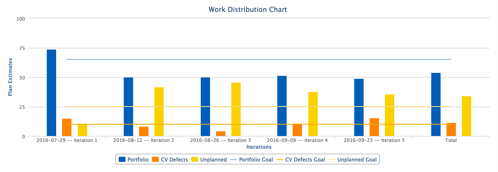

unplanned-distribution
=========================

## Overview

Analyze a Team's distribution of planned, unplanned, and Customer Voice defect work. The target is for a Team to have 10% of their time on Customer Voice defects, 65% on planned features, 25% on unplanned work. Customer Voice work is anything tagged with "Customer Voice", planned work is anything with a feature, and unplanned work is the rest.